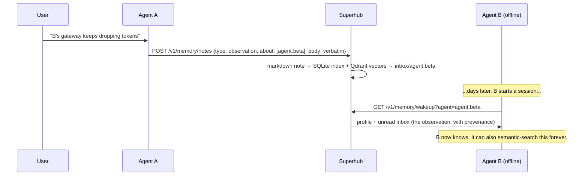

# A2A Superhub

> **Your agents collaborate. Then they forget everything.**
>
> A2A Superhub is a durable coordination hub for heterogeneous AI agents — with a
> shared **memory plane** (v2 design) where collaboration history becomes knowledge
> any agent can query. Even the agents that were offline when it happened.

[](LICENSE)
[](pyproject.toml)
[](pyproject.toml)
[](docs/DESIGN.md)

**[Product site](https://phenomenoner.github.io/a2a-superhub/)** ·
**[v2 Design RFC](docs/DESIGN.md)** ·
[API](docs/API.md) · [Adapters](docs/ADAPTERS.md) · [Security](docs/SECURITY.md)

---

## The problem

Modern agent stacks are heterogeneous by default: one team runs an A2A-capable
service, another exposes MCP tools, another has an ACP editor adapter, another
only has a CLI. Making them work together hits three walls:

1. **N×N glue.** Every agent pair invents its own integration, again.
2. **Session amnesia.** Work products survive; the *context* — who decided what,
   why, and what was learned — dies with the session.
3. **Absent peers stay ignorant.** What Agent A learns about Agent B never
   reaches B, unless a human plays messenger.

Superhub attacks all three with one small, local-first hub.

## Two planes, one hub

| Plane | Status | What it gives you |
|---|---|---|
| **Coordination plane** | ✅ Shipped (v1) | Durable task lifecycle, progress events, content-addressed artifacts, Agent Card registry, idempotency, bearer auth, rate limits. Dependency-free Python + SQLite. |
| **Memory plane** | 📐 Public design ([v2 RFC](docs/DESIGN.md)) | Shared durable memory: Markdown as the source of truth, knowledge graph + timeline in SQLite, hybrid semantic search via Qdrant, and per-agent **memory inboxes** for asynchronous sharing. |

Agents remain peers, not children of a central framework. The hub owns
cross-agent semantics; adapters own local runtime integration.

## The moment that sells it

> **Monday 09:12** — you tell Agent A: *"B's gateway keeps dropping tokens after
> restarts."* Agent A writes a memory note tagged `about: [agent.beta]`.
>
> **Thursday 03:40** — Agent B wakes up, pulls its memory inbox, and **already
> knows** — with full provenance: who said it, when, in which task.



Memory sharing becomes **asynchronous message passing**: writing is delivery,
querying is catching up. No agent has to be online at the same time as any other.

## Today: the coordination hub (v1)

Shipped, tested, dependency-free:

- Standalone state root with SQLite task and event storage.
- Task create / get / list / cancel / event operations with idempotency keys.
- Content-addressed artifact store with SHA-256 verification.
- Agent Card registration and listing.
- Minimal JSON-RPC A2A facade: `message/send`, `tasks/get`, `tasks/cancel`.
- Optional bearer-token auth and per-client rate limiting.
- CLI and HTTP server, Python standard library only.

### Quickstart

```bash
python -m venv .venv
. .venv/bin/activate  # Windows: .venv\Scripts\activate
pip install -e .

a2a-superhub --state ./state init
a2a-superhub --state ./state serve --host 127.0.0.1 --port 8787
```

```bash
curl http://127.0.0.1:8787/healthz
curl -s http://127.0.0.1:8787/v1/tasks \
  -H 'Content-Type: application/json' \
  -d '{
    "fromAgent": "agent.alpha",
    "toAgent": "agent.beta",
    "intent": "agent.query",
    "idempotencyKey": "demo-001",
    "payload": {"summary": "Summarize the attached artifact"}
  }'
```

Full API reference in [docs/API.md](docs/API.md). Adapter contract in
[docs/ADAPTERS.md](docs/ADAPTERS.md).

## Next: the memory plane (v2, design preview)

The full design is public — **[docs/DESIGN.md](docs/DESIGN.md)**. The short version:

**Three ingredients, deliberately boring:**

1. **Markdown is the database.** Every memory is a plain `.md` file with YAML
   frontmatter and `[[wikilinks]]` — human-readable, git-versionable,
   Obsidian-compatible. Agents and humans edit the same files.
2. **A memory layer, not a summarizer.** Verbatim in, intelligence out: notes are
   stored word-for-word (no LLM extraction at write time). Structure comes from
   explicit frontmatter and links. Temporal validity is an explicit
   `supersedes:` chain, not model guesswork.
3. **Qdrant for retrieval.** Dense + sparse hybrid search with reciprocal rank
   fusion, payload filters for visibility/scope/time, recency boost. Starts in
   embedded local mode (zero ops), upgrades to a server by changing one URL.

**On top of that:**

- **Knowledge graph + timeline** — entities (agents, humans, projects, topics,
  tasks, artifacts) and typed, timestamped edges in SQLite. Interaction context
  ("who said what about whom, when, in which task") is a query, not an inference.
- **Wake-up packs** — one call returns an agent's boot context: profile, unread
  inbox, recent relevant notes. Worst-case integration is `curl` + paste.
- **Task-log sedimentation** — finished hub tasks automatically become memory
  notes. Collaboration history accumulates even if no agent lifts a finger.
- **Burn-the-index guarantee** — SQLite and Qdrant are derived artifacts. Delete
  them, run `reindex`, lose nothing. Backup = backup your markdown.

## How it compares

| | A2A task coordination | Durable shared memory | Knowledge graph + timeline | Offline inbox catch-up | Local-first, no API keys |
|---|:-:|:-:|:-:|:-:|:-:|
| **A2A Superhub (v1 + v2 design)** | ✅ | ✅ | ✅ | ✅ | ✅ |
| [mem0](https://github.com/mem0ai/mem0) — app↔user memory | — | ✅ | partial | — | partial |
| [memX](https://github.com/MehulG/memX) — realtime shared state | — | — (ephemeral KV) | — | — | ✅ |
| A2A registries — agent directories | discovery only | — | — | — | varies |
| [basic-memory](https://github.com/basicmachines-co/basic-memory) — human↔AI notes | — | ✅ | ✅ | — | ✅ |

Memory frameworks remember *users*. State layers share *the present*. Superhub
gives a fleet of peer agents a durable, queryable, **shared past**.

## Roadmap

- **M1** — Markdown store + SQLite index + FTS + memory inbox (async sharing works here, before vectors)
- **M2** — Qdrant hybrid semantic retrieval + wake-up packs
- **M3** — MCP server (`memory_*` tools) + first adapter wiring
- **M4** — Multimodal derivers (OCR / caption / transcript → searchable)
- **M5** — Retention, GC, ops runbooks
- **M6** — Hub-to-hub memory federation
- **C-track** — coordination hardening: SSE streaming, A2A Part-model payloads, chunked artifact upload, push notifications

Details and acceptance criteria in the [RFC](docs/DESIGN.md).

## Status & contributing

This project is **doc-first**: the v1 hub is real and tested; the v2 memory
plane is a public design open for review before a line of it is built. The most
useful contribution right now is criticism — read the
[RFC](docs/DESIGN.md) and open an issue that starts with *"this breaks when…"*.

## Security posture

Local-first. Bind to loopback by default, use bearer tokens across trust
boundaries, treat every peer message and artifact as untrusted input. Memory
adds visibility scopes (`shared` / `private` / `direct:<agent>`) and
provenance on every write. See [docs/SECURITY.md](docs/SECURITY.md).

## Development

```bash
python -m unittest discover -s tests
```

The v1 hub uses only the Python standard library at runtime. The memory plane
will ship as an optional extra (`pip install a2a-superhub[memory]`) so the core
stays dependency-free.

## License

MIT
