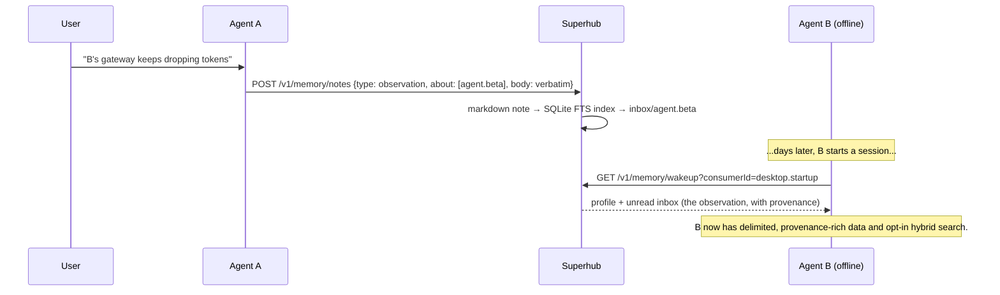

# A2A Superhub

> **Your agents collaborate. Then they forget everything.**
>
> A2A Superhub is a durable coordination hub for heterogeneous AI agents — with a
> shared **memory plane** (opt-in durable memory, offline sharing, hybrid
> retrieval, and a standards-based MCP sidecar) where collaboration history becomes knowledge
> any agent can query. Even the agents that were offline when it happened.

[](LICENSE)
[](pyproject.toml)
[](pyproject.toml)
[](docs/DESIGN.md)

**[Product site](https://phenomenoner.github.io/a2a-superhub/)** ·
**[Shared memory design and implemented surfaces](docs/DESIGN.md)** ·
[API](docs/API.md) · [Adapters](docs/ADAPTERS.md) · [Security](docs/SECURITY.md)

---

## The problem

Modern agent stacks are heterogeneous by default: one team runs an A2A-capable
service, another exposes MCP tools, another has an ACP editor adapter, another
only has a CLI. Making them work together hits three walls:

1. **N×N glue.** Every agent pair invents its own integration, again.
2. **Session amnesia.** Work products survive; the *context* — who decided what,
   why, and what was learned — dies with the session.
3. **Absent peers stay ignorant.** What Agent A learns about Agent B never
   reaches B, unless a human plays messenger.

Superhub attacks all three with one small, local-first hub.

## Two planes, one hub

| Plane | Status | What it gives you |
|---|---|---|
| **Coordination plane** | ✅ Shipped (v1) | Durable task lifecycle, progress events, content-addressed artifacts, Agent Card registry, idempotency, bearer auth, rate limits. Dependency-free Python + SQLite. |
| **Memory plane** | ✅ MCP-integrated foundation (opt-in) + [future design](docs/DESIGN.md) | Implemented Markdown truth, durable ops queue, FTS5 fallback, FastEmbed/Qdrant hybrid retrieval, authorized timeline/graph, multi-consumer inbox, safe wakeup, task-log, a stateless 10-tool MCP stdio sidecar, reference adapter, and operator Skill. A2A 1.0, multimodal derivation, and operational readiness remain future work. |

Agents remain peers, not children of a central framework. The hub owns
cross-agent semantics; adapters own local runtime integration.

## The moment that sells it

> **Monday 09:12** — you tell Agent A: *"B's gateway keeps dropping tokens after
> restarts."* Agent A writes a memory note tagged `about: [agent.beta]`.
>
> **Thursday 03:40** — Agent B wakes up, pulls its memory inbox, and **already
> knows** — with full provenance: who said it, when, in which task.



Memory sharing becomes **asynchronous message passing**: writing is delivery,
querying is catching up. No agent has to be online at the same time as any other.

## Current implemented surfaces

Shipped and tested; the coordination core remains dependency-free:

- Standalone state root with SQLite task and event storage.
- Task create / get / list / cancel / event operations with idempotency keys.
- Content-addressed artifact store with SHA-256 verification.
- Agent Card registration and listing.
- Minimal JSON-RPC A2A facade: `message/send`, `tasks/get`, `tasks/cancel`.
- Optional bearer-token auth and per-client rate limiting.
- CLI and HTTP server, Python standard library only.
- Optional MCP 2025-11-25 stdio sidecar with ten memory/task tools, authorized
  resources, subscription notifications, and polling fallback guidance.

### Quickstart

```bash
python -m venv .venv
. .venv/bin/activate  # Windows: .venv\Scripts\activate
pip install -e .

a2a-superhub --state ./state init
a2a-superhub --state ./state serve --host 127.0.0.1 --port 8787
```

```bash
curl http://127.0.0.1:8787/healthz
curl -s http://127.0.0.1:8787/v1/tasks \
  -H 'Content-Type: application/json' \
  -d '{
    "fromAgent": "agent.alpha",
    "toAgent": "agent.beta",
    "intent": "agent.query",
    "idempotencyKey": "demo-001",
    "payload": {"summary": "Summarize the attached artifact"}
  }'
```

Full API reference in [docs/API.md](docs/API.md). Adapter contract in
[docs/ADAPTERS.md](docs/ADAPTERS.md). MCP setup and exact behavior are in
[docs/MCP_AGENT_INTEGRATION.md](docs/MCP_AGENT_INTEGRATION.md).

### Connect an MCP client

Keep the HTTP hub running with memory enabled, then configure the client to
launch the stateless sidecar:

```bash
pip install -e ".[memory-core,mcp]"
export A2A_SUPERHUB_URL=http://127.0.0.1:8787
export A2A_SUPERHUB_TOKEN=replace-with-a-token-handle
a2a-superhub-mcp
```

On Windows PowerShell, set the variables with `$env:A2A_SUPERHUB_URL=...` and
`$env:A2A_SUPERHUB_TOKEN=...`. The token belongs in the environment, not in the
MCP command line. Each sidecar holds no hub state and can be restarted or run
alongside other clients.

## Memory plane: 🧱 Foundation (opt-in)

The full design is public — **[docs/DESIGN.md](docs/DESIGN.md)**. Durable memory is available
only with `pip install -e ".[memory-core]"` and `serve --enable-memory`; it is
off by default and preserves the coordination-only runtime. Delivery, task-log,
and watcher repair remain separately gated. The foundation has repository-level
end-to-end and restart/replay coverage; it is not a release, SLA, soak, or
operational-readiness claim. The short version:

**Three ingredients, deliberately boring:**

1. **Markdown is the database.** Every memory is a plain `.md` file with YAML
   frontmatter and `[[wikilinks]]` — human-readable, git-versionable,
   Obsidian-compatible. Agents and humans edit the same files.
2. **A memory layer, not a summarizer.** Verbatim in, intelligence out: notes are
   stored word-for-word (no LLM extraction at write time). Structure comes from
   explicit frontmatter and links. Temporal validity is an explicit
   `supersedes:` chain, not model guesswork.
3. **Opt-in hybrid retrieval with FTS5 fallback.** Qdrant dense+sparse candidates
   are authorization-filtered in every prefetch and authorized again against
   Markdown. The default core remains dependency-free and keyword-only.

**On top of that:**

- **Knowledge graph + timeline** — entities (agents, humans, projects, topics,
  tasks, artifacts) and typed, timestamped edges in SQLite. Interaction context
  ("who said what about whom, when, in which task") is a query, not an inference.
- **Wake-up packs** — one call returns an agent's boot context: profile, unread
  inbox, recent relevant notes. Worst-case integration is `curl` + paste.
- **Task-log sedimentation** — when explicitly enabled for an allowlisted intent,
  terminal hub tasks can become structured memory notes without raw payloads.
- **MCP sidecar + reference adapter + operator Skill** — ten stable tools and
  two `memory://` resources reuse the HTTP authorization boundary; a removable client adapter negotiates
  identity/capabilities, inserts only delimited untrusted data, and acks only
  after delivery. The packaged Skill provides doctor/smoke/install workflows.
- **Burn-the-index guarantee** — the current FTS/KG SQLite index is derived.
  Delete it and rebuild the same visible note/edge set from Markdown. Delivery,
  ack, job, task, artifact, and auth state are separate authoritative backups.

## How it compares

| | A2A task coordination | Durable shared memory | Knowledge graph + timeline | Offline inbox catch-up | Local-first, no API keys |
|---|:-:|:-:|:-:|:-:|:-:|
| **A2A Superhub (opt-in shared memory with MCP)** | ✅ | ✅ | ✅ | ✅ | ✅ |
| [mem0](https://github.com/mem0ai/mem0) — app↔user memory | — | ✅ | partial | — | partial |
| [memX](https://github.com/MehulG/memX) — realtime shared state | — | — (ephemeral KV) | — | — | ✅ |
| A2A registries — agent directories | discovery only | — | — | — | varies |
| [basic-memory](https://github.com/basicmachines-co/basic-memory) — human↔AI notes | — | ✅ | ✅ | — | ✅ |

Memory frameworks remember *users*. State layers share *the present*. Superhub
gives a fleet of peer agents a durable, queryable, **shared past**.

The implemented surface has repository end-to-end, restart/replay, official MCP
SDK, and cross-transport evidence. It does not mean A2A 1.0 parity, production
deployment, operational soak, or multimodal support.

## Roadmap

- **Contract and security baseline — 🧱 Foundation:** executable identity,
  note, API, protocol, package, and Skill contracts.
- **Durable memory and offline sharing — 🧱 Foundation (opt-in):** durable
  Markdown, separated operational/derived stores, FTS, inbox/wakeup, a reference
  adapter, and an operator Skill.
- **Hybrid retrieval — 🧱 Foundation (opt-in):** Qdrant dense+sparse retrieval
  with authorization pushdown and keyword fallback.
- **MCP agent integration — ✅ Implemented (opt-in):** ten stable memory/task
  tools, authorized resources, negotiated subscriptions with poll fallback,
  cross-transport scenarios, and Skill/product drift CI.
- **A2A 1.0 runtime binding — 📐 Design RFC:** a standards-compliant binding
  remains separate from the legacy JSON-RPC coordination facade.
- **Multimodal derivation — 🗺 Planned:** OCR, captions, and transcripts become
  searchable derived notes.
- **Operational hardening — 🗺 Planned:** retention, garbage collection,
  backup/restore runbooks, and workload-specific soak evidence.
- **Hub federation — 🗺 Planned:** namespaced, explicitly trusted hub-to-hub
  memory exchange.
- **Coordination hardening — 🗺 Planned:** SSE streaming, A2A Part-model
  payloads, chunked artifact upload, and push notifications.

Details and acceptance criteria in the [RFC](docs/DESIGN.md).

## Status & contributing

This project is **contract-first**: coordination plus opt-in durable memory,
offline sharing, hybrid retrieval, and MCP agent integration are implemented and tested;
the A2A 1.0, multimodal, operational, and federation surfaces remain
incomplete. Read the [RFC](docs/DESIGN.md), the
[contract and security decisions](docs/CONTRACT_AND_SECURITY_DECISIONS.md), and the machine schemas before
opening an issue that starts with *"this breaks when…"*.

## Security posture

Local-first. Bind to loopback by default, use bearer tokens across trust
boundaries, treat every peer message and artifact as untrusted input. Memory
adds visibility scopes (`shared` / `private` / `direct:<agent>`) and
provenance on every write. See [docs/SECURITY.md](docs/SECURITY.md).

## Development

```bash
python -m pip install -e ".[contracts]"
python -m unittest discover -s tests -v
```

This is the canonical clean-development command and is exercised on Windows and
Linux with Python 3.11 and 3.12 in CI. The `contracts` extra contains test-only
official A2A/MCP parsers and JSON Schema validation; the v1 hub still has zero
runtime dependencies. Python 3.13 is not in the supported matrix yet.

The packaging contract also defines `memory-core`, `search`, `mcp`, `derive`,
and the `memory` umbrella extra. `memory-core` enables durable memory only when
the server flag is also present. `search` installs the selected FastEmbed
multilingual MiniLM + BM25 Qdrant provider; use explicit local/server search flags.
`mcp` installs the stateless stdio sidecar; `derive` is intentionally dependency-free until a deriver provider declares its
own PDF/OCR/transcription stack. See [docs/PACKAGING.md](docs/PACKAGING.md).

## License

MIT
