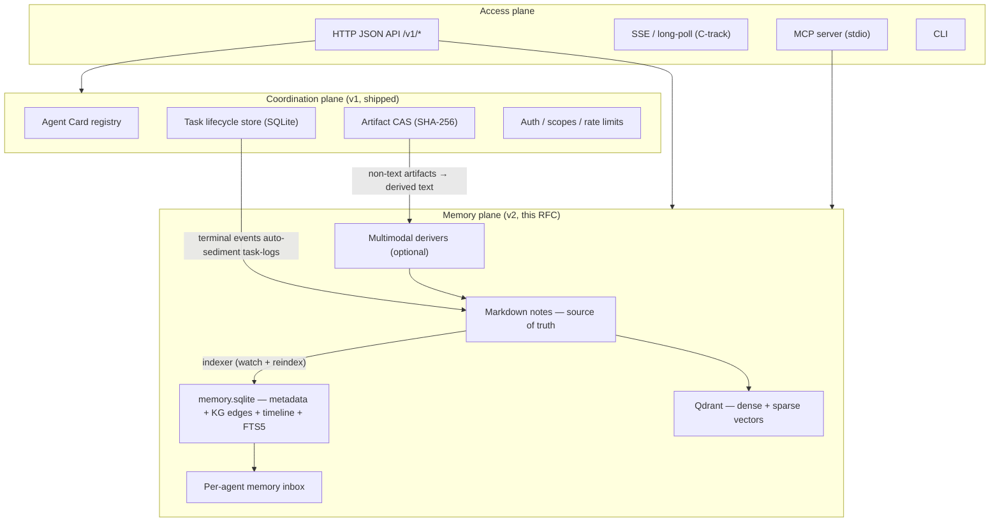
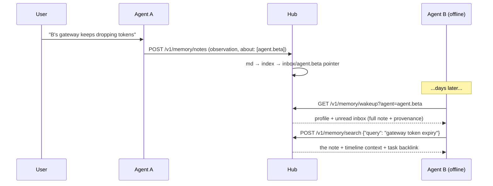

# A2A Superhub v2 — Shared Memory Plane (Design RFC)

Status: **public design, request for comments** — nothing in this document is
implemented yet unless it also appears in [API.md](API.md).
Last updated: 2026-07-18
Feedback: open a GitHub issue, ideally one that starts with *"this breaks when…"*.

## 1. Vision

v1 made heterogeneous agents *coordinate*: durable tasks, events, artifacts,
agent cards. v2 makes them *remember together*:

- Collaboration history **sediments** into a shared, durable memory layer.
- That layer is organized into a lightweight **knowledge graph and timeline**,
  so interaction context ("who said what about whom, when, in which task") is a
  query, not an inference.
- Memory written by one agent is **asynchronously shared** with others: an agent
  that was offline for days catches up in one call.

Design constraint, stated up front: **keep it simple.** The memory plane is made
of exactly three ingredients — markdown files, a thin memory layer
(palace-style organization, verbatim storage, temporal validity), and Qdrant
for retrieval. No graph database. No LLM in the write path.

## 2. Architecture: three planes



Non-negotiable invariant: **markdown is the only truth.** `memory.sqlite` and
the Qdrant collection are derived artifacts. Deleting `index/` and running
`a2a-superhub memory reindex` must reproduce identical query behavior. Backup
is `git` on the markdown tree.

## 3. Memory layout

Palace-style hierarchy (a nod to memory-palace systems), expressed directly as
directories:

```text
state/memory/
  agents/<agent-id>/          # each agent's "wing"
    profile.md                # long-lived self-description
    diary/2026/07/...         # private journal (visibility: private)
  shared/
    projects/<slug>/          # "rooms" by project
    topics/<slug>/            # "rooms" by topic
    tasklog/2026/07/task_x.md # auto-sedimented collaboration records
    people/<human-id>.md      # optional profiles for human participants
  inbox/
    <agent-id>.jsonl          # append-only pointers {noteId, reason, createdAt}
    <agent-id>.cursor         # read cursor
  index/                      # fully rebuildable
    memory.sqlite
    qdrant/
```

`inbox/` stores **pointers, never content** — content exists exactly once, in
the markdown tree. Permission changes and deletions take effect immediately for
everyone.

## 4. The memory unit

One memory = one markdown file: YAML frontmatter (structured facts) + verbatim
body + explicit relations.

```markdown
---
id: mem_9f3a1c
title: Discussed agent.beta gateway token expiry with the user
type: observation            # note | decision | handoff | observation | task-log | profile
project: a2a-superhub
participants: [agent.alpha, user.jane]
about: [agent.beta]          # who this memory is ABOUT → triggers inbox delivery
tags: [gateway, config]
task: task_ab12              # provenance: originating hub task (optional)
artifacts: [art_77c0]
created: 2026-07-18T09:30:00Z
author: agent.alpha
visibility: shared           # shared | private | direct:<agent-id>
supersedes: mem_1122         # optional: explicit temporal invalidation
---

(Verbatim body. No LLM summarization at write time — ever.)

The user reports agent.beta's gateway drops tokens after overnight restarts.
Suggested check: gateway env expiry before first request...

## Relations
- about [[agent.beta]]
- derived_from [[task_ab12]]
- relates_to [[topics/gateway-stability]]
```

Rules:

1. **Verbatim body.** Summarization/extraction is a read-time concern, never a
   write-time requirement. This keeps writes cheap, lossless, and auditable.
2. **Structure lives in frontmatter + `## Relations` wikilinks only.** The
   indexer performs zero NLP guessing.
3. `author` is derived from the authenticated caller, never trusted from the body.
4. Humans editing files by hand is legal: the indexer watches the tree and
   converges; files missing an `id` get one assigned and written back.

Six note types at launch: `note`, `decision`, `handoff`, `observation`
(the async-sharing workhorse), `task-log` (hub-written), `profile`.

## 5. Index layer (`memory.sqlite`)

Four table groups, all derived from markdown:

```sql
CREATE TABLE notes (
  note_id TEXT PRIMARY KEY, path TEXT NOT NULL, title TEXT, type TEXT,
  project TEXT, author TEXT, visibility TEXT,
  created_at TEXT, updated_at TEXT,
  task_id TEXT, supersedes TEXT, superseded_by TEXT,
  body_hash TEXT
);

CREATE TABLE kg_nodes (
  node_id TEXT PRIMARY KEY,   -- 'agent:agent.beta' / 'note:mem_x' / 'topic:gateway'
  kind TEXT NOT NULL, label TEXT
);

CREATE TABLE kg_edges (
  edge_id TEXT PRIMARY KEY,
  src TEXT NOT NULL, rel TEXT NOT NULL, dst TEXT NOT NULL,
  note_id TEXT NOT NULL,      -- provenance: which memory asserted this edge
  observed_at TEXT NOT NULL,  -- = note.created
  valid_until TEXT            -- filled when a supersedes chain invalidates it
);

CREATE VIRTUAL TABLE notes_fts USING fts5(note_id, title, body, tags);
```

Edges come from exactly three sources — frontmatter fields, `## Relations`
wikilinks, and hub task provenance (from/to/conversation, joined at reindex).
No LLM entity extraction in v2. Graph queries are limited to 1–2 hops, which is
two indexed SQLite JOINs — this is why there is no graph database in the stack.

## 6. Retrieval: four views

### 6.1 Hybrid semantic search (Qdrant)

- Chunks of body + title + tags → **dense** vectors (local embedding model via
  FastEmbed; multilingual default) + **sparse** BM25, fused with reciprocal
  rank fusion via Qdrant's Query API prefetch.
- Payload carries `visibility / author / about / project / type / created_ts`,
  so scoping and permissions are **filter pushdown**, not post-filtering —
  unauthorized content never even receives a score.
- Optional recency boost: `score' = rrf × (1 + w·decay(age))`, small `w`,
  disable per query.

### 6.2 Timeline

```text
GET /v1/memory/timeline?project=...         # project narrative
GET /v1/memory/timeline?pair=alpha,beta     # interaction history of two agents
GET /v1/memory/timeline?about=agent.beta    # everything ever said about beta
```

Chronologically ordered note cards (id/title/type/author/participants/task
backlink). Zero inference cost — it is a sorted, filtered index scan.

### 6.3 Graph neighborhood + temporal validity

- `GET /v1/memory/graph?node=agent:agent.beta&hops=1` — adjacent edges with
  rel, observed_at, and the note that asserted each edge.
- Temporal validity is an **explicit supersedes chain**: note X declaring
  `supersedes: Y` marks Y `superseded_by = X` and closes Y's edges with
  `valid_until = X.created`. Retrieval hides superseded notes by default
  (`includeSuperseded=true` shows history). Invalidation is a deliberate,
  auditable statement by an agent or human — not model conjecture.

### 6.4 Wake-up pack

`GET /v1/memory/wakeup?agent=X&budgetBytes=N` returns one bounded markdown
document: the agent's profile, unread inbox, recent participated notes, and
memory linked to its in-flight tasks. Worst-case integration for any runtime is
"curl and paste into context."

## 7. Asynchronous memory sharing (the differentiator)

Mechanism — **write is delivery, pointers not copies, pull-first push-assist**:

1. On note landing, the indexer checks delivery conditions: `about` contains an
   agent, `visibility: direct:<agent>`, or `type: handoff` naming a recipient.
2. Each recipient gets one pointer line appended to `inbox/<agent>.jsonl`.
3. Recipients pull with a cursor:
   `GET /v1/memory/inbox?agent=X&since=<cursor>` → full notes + next cursor.
   Reading and acknowledging are separate (`POST /v1/memory/inbox/ack`), so a
   crashed adapter re-pulls safely. Delivery is idempotent.
4. Optional push — a low-priority A2A task (intent `memory.notify`) or an SSE
   event — exists only to *wake* the recipient. **Truth is always the pull.**
   A lost push can never cause divergent memory.

Why pull-first: the recipient may be offline for days — that is precisely the
scenario this feature exists for. Cursor pulls give free catch-up, replay, and
multi-device semantics. The `reason` field (`about` / `direct` / `handoff`)
lets an agent distinguish "work handed to me" from "things said about me."



## 8. Multimodal memory (optional derivers)

Non-text content always enters the **artifact CAS** (v1 mechanism); notes
reference it via `artifacts:`. An optional deriver pipeline (off by default)
turns selected media types into indexable text — image→OCR/caption,
audio→transcript, pdf→text — stored as `shared/derived/<artifactId>.derived.md`
with a `derived_from` backlink, entering the same index. Searching "that
architecture diagram" hits the caption and follows the edge back to the image.
The deriver interface is `derive(manifest, bytes) -> markdown`; implementations
may use local models or remote APIs; the hub core bundles none.

## 9. API surface (sketch)

### HTTP (`/v1/memory/*`)

| Endpoint | Purpose |
|---|---|
| `POST /v1/memory/notes` | Write a note (idempotencyKey supported; `about` others requires `memory.share` scope) |
| `GET /v1/memory/notes/<id>` | Read one note |
| `POST /v1/memory/search` | Hybrid / semantic / keyword search with filters |
| `GET /v1/memory/timeline` | project / pair / about views |
| `GET /v1/memory/graph` | 1–2 hop neighborhood |
| `GET /v1/memory/wakeup` | bounded boot-context pack |
| `GET /v1/memory/inbox` + `POST /v1/memory/inbox/ack` | cursor pull + acknowledge |
| `POST /v1/memory/reindex`, `GET /v1/memory/stats` | admin |

Notes are append-oriented: `PATCH` may append body sections and tags; changing
your mind is a new note with `supersedes:`. Deletion is soft and admin-scoped.

### MCP

A deliberately small tool set (10 tools): `memory_write`, `memory_search`,
`memory_read`, `memory_timeline`, `memory_graph`, `memory_wakeup`,
`memory_inbox`, `memory_inbox_ack`, `task_create`, `task_status` — plus
`memory://note/<id>` and `memory://wakeup/<agent>` resources. The MCP server is
a stateless sidecar speaking HTTP to the hub.

### A2A

The hub and memory-capable peers declare an extension in their Agent Cards:

```json
{"capabilities": {"extensions": [{
  "uri": "https://github.com/phenomenoner/a2a-superhub/ext/shared-memory/v1",
  "required": false
}]}}
```

Memory intents ride the existing task channel — `memory.notify` (wake a
recipient), `memory.push` (hub-to-hub replication with `originHub` provenance,
later), `memory.query` (federated query, later). No new transport is invented,
so federation inherits task-channel auth, idempotency, and receipts.

### Scopes

| Scope | Grants |
|---|---|
| `memory.read` | search / timeline / graph / read notes |
| `memory.write` | write own diary + shared notes |
| `memory.share` | write `about:` others / `direct:` visibility (inbox delivery) |
| `memory.admin` | reindex, delete, retention |

Visibility is enforced as filter pushdown at query time. Every write carries
provenance (author, time, source task); inbox consumption is cursor-audited.

## 10. Technology choices

| Layer | Choice | Why |
|---|---|---|
| Truth | Markdown + YAML frontmatter | human/agent co-editable, git-versionable, outlives every tool |
| Index / KG / timeline | SQLite (WAL) + FTS5 | already in the stack; 1–2 hop graph = indexed JOINs; fully rebuildable |
| Vectors | Qdrant — embedded local mode first, server later | native dense+sparse hybrid + RRF; payload filter pushdown; **same client API in both modes** — upgrade is a connection string |
| Embeddings | FastEmbed (ONNX, CPU, local) | no API keys, offline-capable, multilingual default |
| Watching | watchdog + `reindex` CLI | humans edit files by hand; the index converges |
| HTTP | stdlib (unchanged) | dependency-free core is part of the product's identity; heavy lifting lives in Qdrant |
| Packaging | `pip install a2a-superhub[memory]` | core stays zero-dependency; memory is an optional extra; MCP server is `[mcp]` |

Deliberate rejections:

- **No general memory framework as a base** (mem0/Zep/Letta): they model
  app↔user memory and extract facts with an LLM at write time — wrong scope
  axis (we need agent↔agent provenance) and wrong write path (we require
  verbatim).
- **No graph database**: every planned query is a shallow JOIN. `kg_edges`
  exports losslessly to any graph DB if that ever changes.
- **No LLM in the write path**: cost, latency, and silent lossiness. LLM-assisted
  linking may appear later as an explicitly-labeled batch job.

### Performance budget (single host, ~10⁴ notes)

| Operation | Target |
|---|---|
| note write → 201 | < 50 ms (markdown lands, index async) |
| index lag | < 1 s p95 (reported as `indexLagMs`) |
| hybrid search | < 200 ms local mode / < 50 ms server |
| wakeup pack | < 300 ms |
| timeline / graph | < 50 ms |

Scale breakpoints, each independent: Qdrant → server at ~10⁵ points; SQLite →
Postgres when multiple hub writers appear; stdlib HTTP → ASGI at >200
concurrent connections.

## 11. Roadmap

| Phase | Scope | Exit test (selection) |
|---|---|---|
| **M0** | Contracts: note schema v1, layout, scopes, API + MCP contract, extension URI | schemas validate; negative cases documented |
| **M1** | md store + SQLite index + FTS + **inbox** + timeline/graph/wakeup + task-log sedimentation — *no vectors yet* | `md_is_truth` (delete index, rebuild, identical results); `inbox_offline_catchup`; `visibility_enforced`; `supersede_chain` |
| **M2** | Qdrant hybrid retrieval + recency boost + payload filters | `hybrid_beats_fts_on_paraphrase`; `filter_pushdown_visibility`; mixed-language smoke |
| **M3** | MCP server + first adapter wiring (e.g. an ACP-capable agent pulls wakeup/inbox at session start, writes handoffs at session end) | end-to-end demo of §7 |
| **M4** | Multimodal derivers (reference: pdf→text, image→OCR) | search hits a caption, follows edge to the artifact |
| **M5** | Retention/GC, backup runbooks, stats | — |
| **M6** | Hub-to-hub federation (`memory.push` / `memory.query`) | — |
| **C-track** | Coordination hardening: SSE streaming (`message/stream`, `tasks/resubscribe`), A2A Part-model payloads, raw + chunked artifact upload, push notification config, capability negotiation | interleaves with M-track |

M1 is the pivotal release: with only two new dependencies (PyYAML, watchdog) the
core story — sedimentation + async sharing — runs end to end, using FTS keyword
search until vectors arrive in M2.

## 12. Prior art and references

- [mempalace](https://github.com/mempalace/mempalace) — verbatim-first storage,
  palace hierarchy, temporal validity, wake-up context; strong evidence that
  hybrid retrieval over verbatim text needs no LLM in the loop.
- [basic-memory](https://github.com/basicmachines-co/basic-memory) — markdown +
  frontmatter + wikilinks as a knowledge graph, `memory://` resources over MCP.
- [Qdrant](https://github.com/qdrant/qdrant) — hybrid dense+sparse retrieval,
  Query API fusion, payload filtering, embedded local mode.
- [Graphiti](https://github.com/getzep/graphiti) /
  [Zep paper](https://arxiv.org/abs/2501.13956) — bi-temporal knowledge-graph
  memory; our `supersedes` chain is a deliberately minimal cousin.
- [mem0](https://github.com/mem0ai/mem0), [Letta](https://github.com/letta-ai/letta),
  [cognee](https://github.com/topoteretes/cognee) — the app↔user memory
  landscape this design intentionally does not compete with.
- [memX](https://github.com/MehulG/memX) — realtime shared state for agent
  fleets; the ephemeral complement to this durable layer.
- [A2A protocol](https://github.com/a2aproject/A2A) — the coordination substrate
  and the extension mechanism this design rides on.

## 13. Open questions (please attack these)

1. Is per-note visibility enough, or do rooms need ACLs of their own?
2. Should `task-log` sedimentation be opt-in or opt-out per intent?
3. Inbox retention: unbounded JSONL vs. windowed with archival?
4. Is a 10-tool MCP surface too small for real adapter authors?
5. Federation trust model: is `originHub` provenance sufficient against a
   malicious peer hub, or does v1 federation need signed notes?
